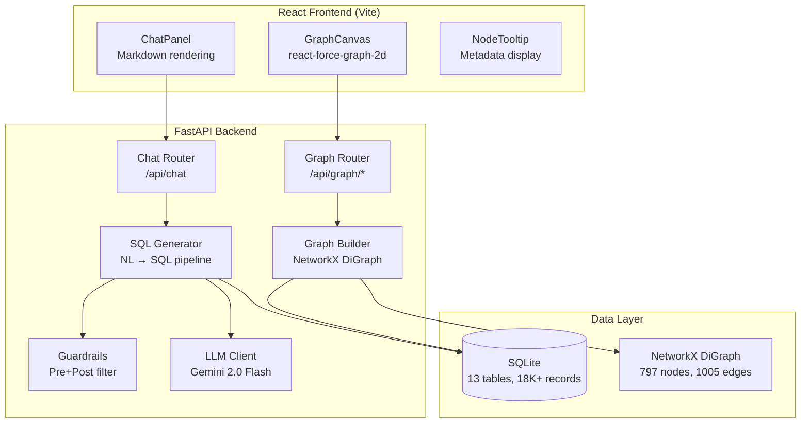

# O2C Context Graph — Graph-Based Data Modeling & LLM Query System

A full-stack application that unifies fragmented SAP Order-to-Cash data into an interactive graph with an LLM-powered natural language query interface.

    

---

## Architecture



## Database Choice: SQLite + NetworkX

| Decision | Rationale |
|---|---|
| **SQLite** (structured queries) | Zero infrastructure, portable, embedded — perfect for a demo. Supports complex JOINs for the LLM-generated SQL queries. Fast for dataset of this size (~18K records). |
| **NetworkX** (graph operations) | In-memory Python graph library. Enables fast neighborhood traversal, entity expansion, and search without a separate graph DB. Built at startup from SQLite data. |
| **Why not Neo4j/ArangoDB?** | Overkill for this dataset size. Would add deployment complexity and require separate infrastructure. SQLite + NetworkX gives us both relational queries (for LLM-generated SQL) AND graph traversal (for visualization) with zero external dependencies. |

## LLM Prompting Strategy

### System Prompt Design
The system prompt includes:
1. **Full database schema** dynamically injected — all 13 tables with column names, types, and FK relationships
2. **10 documented relationships** explaining how entities connect in plain English
3. **Structured JSON output format** — the LLM always responds with `{reasoning, sql_query, answer, referenced_entities, confidence}`
4. **7 few-shot examples** covering: simple lookup, aggregation, flow tracing, anomaly detection, multi-hop joins, and 2 guardrail rejection examples
5. **Explicit instructions** about read-only SQL, table/column naming, and result formatting

### Query Pipeline
```
User Question → Pre-Filter (guardrails) → LLM (Gemini) → Parse JSON → Validate SQL → Execute SQL → Format Answer
```

## Guardrails

### Pre-Filter (before LLM call)
- **Off-topic pattern matching**: Regex patterns for creative writing, general knowledge, personal questions
- **SQL injection detection**: Catches `; DROP`, `UNION SELECT`, `OR 1=1`, comment injection
- **Dataset keyword check**: Validates query contains O2C-related terms
- **Input length limit**: Rejects queries >5000 characters

### Post-Filter (after LLM response)
- **SQL validation**: Only `SELECT`/`WITH` allowed. Blocks `DROP`, `DELETE`, `UPDATE`, `INSERT`, `ALTER`, `CREATE`
- **Table validation**: Cross-checks referenced tables against schema
- **Response structure validation**: Ensures all required JSON fields are present
- **Confidence caveat**: Appends warning for confidence < 0.3

## Setup Instructions

### Prerequisites
- Python 3.10+
- Node.js 18+
- Google Gemini API key (free: https://ai.google.dev)

### Backend Setup
```bash
cd backend
pip install -r requirements.txt

# Copy and edit .env
cp .env.example .env
# Add your GEMINI_API_KEY to .env

# Ingest dataset (JSONL → SQLite)
python scripts/ingest.py data/raw

# Start server
python -m uvicorn app.main:app --host 0.0.0.0 --port 8000
```

### Frontend Setup
```bash
cd frontend
npm install
npm run dev
```

Open http://localhost:5173

## Project Structure

```
o2c-graph-system/
├── backend/
│   ├── app/
│   │   ├── main.py              # FastAPI entry + CORS + lifespan
│   │   ├── config.py            # Environment config
│   │   ├── database.py          # SQLite schema + safe SQL executor
│   │   ├── graph/
│   │   │   └── builder.py       # NetworkX graph construction
│   │   ├── llm/
│   │   │   ├── client.py        # Gemini API client + retry
│   │   │   ├── prompts.py       # System prompt + few-shot examples
│   │   │   ├── guardrails.py    # Pre/post query filtering
│   │   │   └── sql_generator.py # NL → SQL → Answer pipeline
│   │   └── routers/
│   │       ├── graph.py         # Graph API (overview/expand/search)
│   │       └── chat.py          # Chat API + conversation memory
│   ├── scripts/
│   │   └── ingest.py            # JSONL data ingestion
│   ├── data/                    # SQLite DB + raw JSONL files
│   └── requirements.txt
├── frontend/
│   ├── src/
│   │   ├── components/
│   │   │   ├── GraphCanvas.jsx  # Force-directed graph
│   │   │   ├── ChatPanel.jsx    # Chat interface
│   │   │   └── NodeTooltip.jsx  # Node metadata popup
│   │   ├── services/api.js      # Backend API client
│   │   ├── App.jsx              # Main layout
│   │   └── App.css              # Full dark theme styles
│   └── package.json
└── README.md
```

## Features

- **Interactive Graph**: Force-directed visualization with 9 entity types, click-to-expand, node search
- **Natural Language Queries**: Ask questions in English, get SQL-backed answers
- **Flow Tracing**: Trace Order → Delivery → Billing → Journal → Payment chains
- **Anomaly Detection**: Find broken/incomplete flows
- **Topic Guardrails**: Rejects off-topic and malicious queries
- **Conversation Memory**: Maintains context across follow-up questions

## Example Queries

- "Which products are associated with the highest number of billing documents?"
- "Trace the full flow of billing document 91150187"
- "Find sales orders that have broken or incomplete flows"
- "Show me all orders from customer 310000108"
- "What is the total billing amount for 2025?"

## Known Limitations

1. **No direct Order→Delivery→Billing links**: SAP's VBFA document flow table is absent from the dataset. Flow tracing uses customer matching as proxy.
2. **Free LLM tier**: Gemini free tier has rate limits (15 RPM). Heavy usage may hit limits.
3. **In-memory graph**: The NetworkX graph is rebuilt on each server start. Fine for ~18K records but won't scale to millions.
